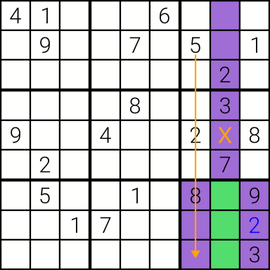
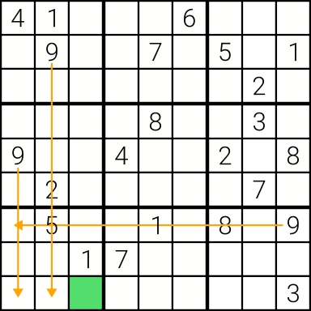

# Sudoku Solver

A simple Sudoku solver, implemented in idiomatic Rust *without* memory allocation. It exclusively uses deductive reasoning (i.e., no backtracking).

## Algorithm

The implemented algorithm consists of two main strategies.

### Strategy: Necessary 3-cell Fragments

Consider the green 3-cell fragment. Within its block, 5 is impossible outside the fragment, thus 5 *must be* somewhere in the green fragment. Hence, the value 5 cannot occur anywhere else in the purple region. Particularly, we can remove 5 as a possibility from the cell marked X.

When extending this principle, any row or column intersecting with a block results in such a 3-cell fragment. We establish which values necessarily exist in the fragment, and remove these from its influenced regions (i.e., block and row/column).

### Strategy: Solving Unique Options

Consider the green cell. It has several remaining options, namely `2,4,6,7,8,9`. However, it is the only cell in its block with 9 as an option. Thus, it has to be 9.

We can extend this principle for any row, column, and block. Whenever a cell is the only one with a particular value option, we can assign it.

## Limitations

This solver cannot solve all (deterministic) Sudokus, but it solves many. Without backtracking, we require (infinitely?) many more strategies.

## License

BSD-3 - See `LICENSE`
